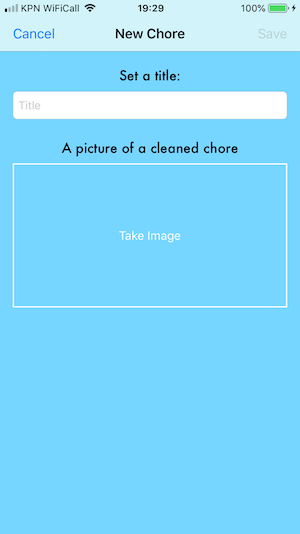

# Day 1
Today I submitted my final proposal at https://github.com/freesers/AppStudioProject/blob/master/README.md
I'm planning to make a WieBetaaldWat-like app for cleaning schedules in student houses. After consulting with a TA i found out the server component can be done using FireBase. 

# Day 2
Today I submitted my (first) design document and I met with my group (H) 

The user first logs in or registers, the is presented with a tab bar controller between three main screens. Then there will be a couple loose viewcontrollers either presented modally or with a show - detail style. 

The first ideas on how the data should be modeled. The main structures are Users (detailing user information) and Chores.

# Day 3
Today I mainly foccused reading the Human Interface guidelines and working on my prototype. Spent the day reading up on FireBase, articles from John Sundell (https://www.swiftbysundell.com) about GCD and the basics of UserNotifications

# Day 4
The day started off with our first team meeting with Emma, we discussed our projects and prototypes. Fried (teammember) mentioned that he had had a TA telling him FireBase might be too big for the scope of this project. And to use a local server instead. I'm personally not sure yet whether I want to use it or not, as a local server would kind of defeat the purpose of this app. I finished the day with completing my prototype and reading more about FireBase Realtime Storage
Storyboard:

Detail of first version custom table cell:

# Day 5
Spent all day trying to get FireBase storage to work, unfortunately too large a hassle to integrate into the project (Should have listened to earlier advice). Decided I will only be using FireBase for Authentication, then using the specific UID in own local server. Will modify the resto server to work with my app.

# Day 6
Today I began modelling the datastructure of the users and houses. I decided I'd create datamodelcontrollers which can be used troughout the app. Still have to figure out how to make it work with the new resto server, Martijn still has to do some modifcations to the server for it to work with the app (filtering in querries). 
Then had a team meeting for the basic style guide (https://github.com/freesers/AppStudioProject/blob/master/STYLE.md) and updates. Fried is also waiting on the server to work.
Almost finished with work for user registration. Uses FireBase Auth, for registration and login. Handles most cases (wrong password, same email etc. Decided that if you chose to create a new house, you become the administrator. App warns you about that. 
Basic registration screen:

# Day 7
I completed the registration procces, users can now register, select or create house, login, logout and stay logged in. One problem when you restart the app but are logged in: loggout unwind segue doesn't work because the loginViewController is not loaded. Couldn't figure it out and no TA available.
Will try to sync users and houses with the server tommorow

# Day 8 
Problem from yesterday solved, always boot with loginVC and immediately segue to next screen if already logged in. Further polished registration/login process. After that I started to work with the server. Used a playground to test network functions. Figured out al the code to work with the reste server. I can store multiple key-value pairs in the same array index. 
I will use /list & /menu as users and houses. Also encoded image to ascii to store on the server, retrieving and decoding work as well.

# Day 9
The network code to store users on the server works, also loading users to have their information ready throughout the app. Unfortunately, I later realised that the resto server had been updated with new filtering options. Which made previous work unnecessary, I also strugled a very long time with a very simple bug that i only spotted at the end of the day. Hopefully tommorow I can add in the rest of the house info to the server.

# Day 10
Finally figured all the network stuff out, completion blocks in completion blocks... Wrote extensions to UIViewcontroller and UIColor to have keyboarddismissal and custom app color easily available troughout the app. Users can now add basic chore to the table view.

# Day 11
Houses and residents can be added, new users can choose existing houses. Users can see the other residents in the house. 
Server code had to be adjusted to work with arrays. Networkcode now shows networkactivity indicator. Some buttons have animations

# Day 12
Chores can be updates to the server, including the encoded jpeg image. PNG is too large. Wrote all of the Date & Calender code to keep track of the cleaning day. Chores can be downloaded, only the image doesn't decode yet

# Day 13
Image decoding problem solved. Residents can now upload and delete chores (if they are administrator). And all users download the chores for their house. Residents can now complete a chore by tapping "cleaned", they will have to take a picture as verification. Updated chore is uploaded to server. 
To make tableview quicker; all chores are stored in the documents directory, quickly showing the last known chores (and corresponding images), then replacing with the new ones. Will choose not to implement the chore -> detail viewcontroller as it won't present new information. Instead tapping the picture of the chore will show a viewcontroller dedicated for the picture, with zooming capabilities. 
### Tasks left: 
* image viewcontroller
* automatic schedule
* leave house option
* prettier "residents" tap
* overal prettier design

# Day 14
Finished the imageviewcontroller. Users can now tap an image and pan/zoom the image. The automatic schedule is done. Created quite a few problems because the tableview is dynamic and the number of residents/chores needn't be the same. Made a workaround the loop the residents over the chores. Made an ScheduleController which creates the correct schedule upon opening app.
#### Stretch goal
* local notification to alert user of chore

# Day 15
Schedule didn't change properly when a new week started. To tackle this, the array is shifted at launch of the app from a reference date. Created local notifications with UserNotifications. Users are presented a notification saterday afternoon if they are due for a chore that week. Created an animation to fade in the chores upon launch too look more fluid

###### Saterday
Made sure everything is nicely commented and looks acording to the style guide. And added a little easter egg to the Schedule tab

# Day 16
Made a coherent app design. Settled on a type of blue that is used troughout the app. Choose Futura as font type for most stuff. Fiddled a lot with the chore cell, but finally chose a small blue border around the image and the blue background that shows trough the navigation controller. Tried to add a feature that shows how many chores each resident completed, but too much a hassle so I didn't finish it. Might do it if I have time left tommorow and wednessday.
The resident tab contains a small tableview with the residents. Users can now also leave the house and delete their account.
### TODO:
* app icon
* error messages to the user
* new message delete alert
* loading chores faster
* perform segue before save
* testing
* (stretch) finish chore count

### New Screens:

# Day 17
Made app icon, updated the warning if user wants to leave house. New error messages if something goes wrong with server. Decided not to finish chore count. Not enough time, and want to further polish the existing app. Added functionality that the administrator can only go in editing mode of the chores view if the network request is done. Display a little alert if tapped before network request

# Day 18
Loading chores bug fixed, and now sorts chores on alphabet. Lasts code tweaks. Discussed and tested each others app in the team meeting, talked about features that we decided to skip. 

