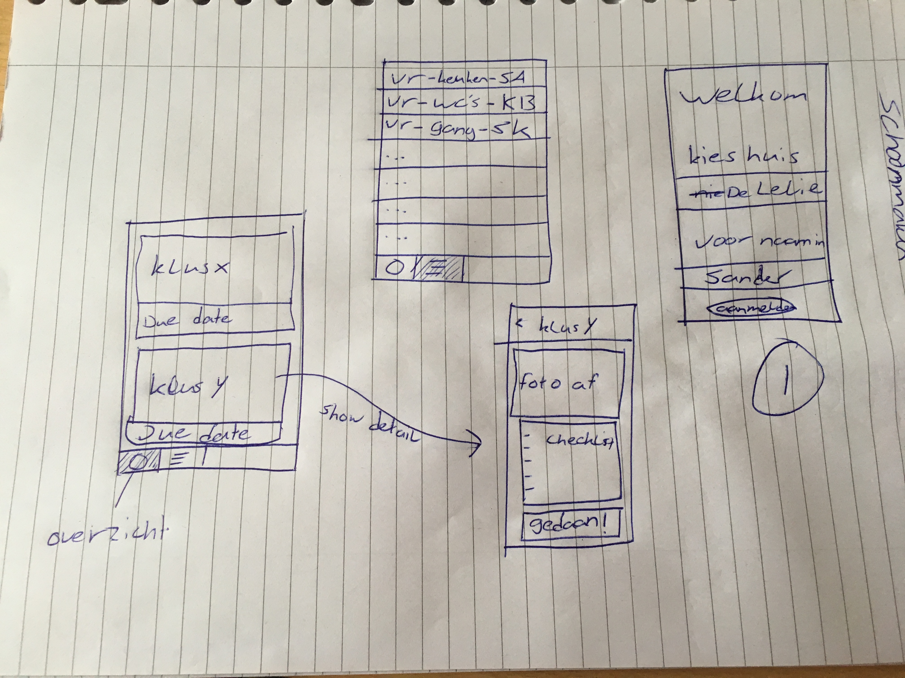

# AppStudioProject - Studentenhuis Schoonmaak (niet de uiteindelijke titel)
# Sander de Vries
Deze app moet als het ware de Wie Betaalt Wat van de schoonmaakroosters in studentenhuizen worden.
Alle taakjes worden evenredig verdeeld onder de bewoners

## Problem Statement
In studentenhuizen wordt vaak gewerkt met schoonmaaklijstjes, helaas wordt dit vaak vergeten, of raken de papiertjes kwijt.
Door middel van deze app kan iedereen in het huiz zien wat de schoonmaaktaakjes zijn, en roosterst de app iedereen gelijkwaardig in. Om ervoor te zorgen dat je het niet vergeet krijgt degene die verantwoordelijk is een herinnering op z'n telefoon.

## Oplossing
Het roosteren van schoonmaakdiensten in studentenhuizen moderniseren

### Main Features
#### MVP
1. Laat beheerder klusjes invoeren
2. Huisbewoners kunnen zich bij het huis aanmelden
3. Huisbewoners hebben een overzicht van de klusjes en wat hiervoor gedaan moet worden.
4. Huisbewoners worden automatisch ingedeeld door de app voor een klusje
5. Huisbewoners kunnen het rooster zien waarop staat wie wat wanneer moet doen. 
6. Huisbewoners krijgen een notificatie als ze aan de beurt zijn
7. Een kleine online server die de gebruikers gebruiken om de app te synchroniseren ( anders zou de huisbewoner/beheerder de app lokaal kunnen gebruiken, en via een whatsapp sharesheet het rooster delen.)
#### Optional
7. Laat een badge zien als jouw klusje nog moet gebeuren
8. 

## Prerequisites
#### Frameworks
UserNotifications

#### external components
Server (dacht eraan om de server van restaurant aan te passen) 
SQLlite
FireBase

#### Similar apps
Nog niet een app gevonden op de AppStore die dit ook doet

#### Hardest parts
Het syncen van de huisbewoners
Lokale notificaties

