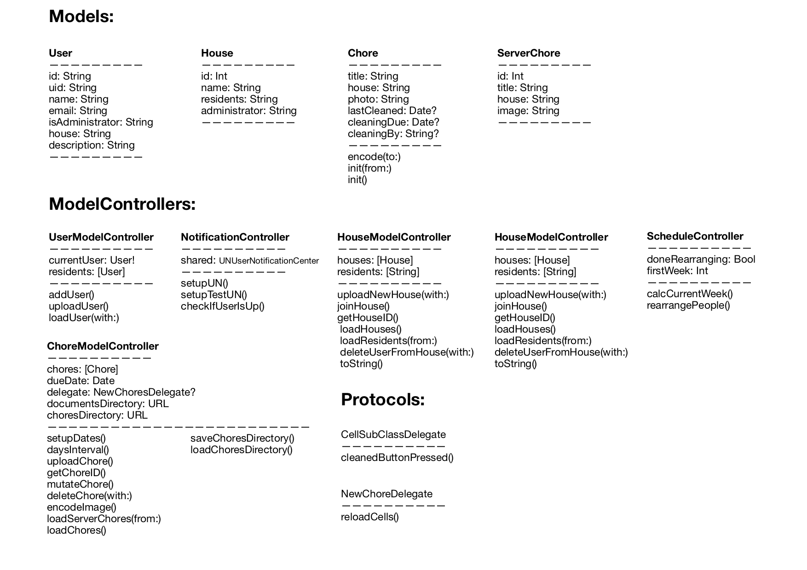

# Final Report - Sweep

Sweep lets users create and join houses to manage the chores that need to be done. To make sure everybody does their chores, Sweep automatically schedules every resident and notifies them when they're up. And to check whether someone has done their chore correctly, residents have to take a picture when they're done.

## Technical Desgin

### LoginViewController
Handles the login screen. If user is already signed in, he/she is redirected to the choreTableView. Requests all neccesary data (User info, House info & corresponding Chore info) with help from the User-, House- and ChoreModelController from the server. After a succesful verification with FireBase and the local server, the current schedule is calculated and the user is redirected to the choreTableView. This viewcontroller is also the destination of the unwind segues: sign out & leave house. If a user doesn't have an account yet, he/she can tap the "register" button, which segues to user to the RegisterViewController. 

### RegisterViewController
Handles all interactions when a new user registers. New users have to enter a correct email and long enough password, and will get notified if they fail to do so. New users can choose to create a new house, or pick an existing house from a picker viewer. When a user creates a new house, he/she will become the administrator of that house. He/she can add and delete chores. When the user taps the registers button, all fields are checked for input and correctness. If correct, a new User (with possible a new House) is created & uploaded with help of the UserModelController & HouseModelcontroller. The user then segues to the ChoresTableViewcontroller.

### ChoreTableViewController
Handles the tableview of all Chore(s) in a House. Shows when they're due, how long until due date & whom is responsible. This viewcontroller also asks the NotificationController if a push notification should be scheduled. Whenever the user who's signed in is an administrator, this viewcontroller enables the "addChoreButton" and editing of the tableview. Upon first load, the cells fade in. The loading of the chores which begun in the LoginViewController continues until the server request is complete, the cells are then reloaded through the NewChoresDelegate that tells the delegate cells should be reloaded. In the meantime, the chores last seen in the app are already loaded from the documentsdirectory, not leaving the user have to wait before he/she sees content. All the data needed for loading the tableview is received from the User-, House- & ChoreModelcontroller. The viewcontroller also conforms to CellSubClassDelegate and NewChoresDelegate which handle the interaction with the cell.
Whenever the "cleaned" button is tapped, an imagepickercontroller is presented which lets the user take a picture of the finished chore. The image of the cell is updated and the ChoreModelController is asked to mutate a chore on the server

### ChoreTableViewCell
This subclass of UITableViewCell sets up the custom button, borderwith of the imageview and creates a tapable overlay on the image. It also informs the delegate that the image or button has been tapped. The ChoreTableViewController is then notified which cells is tapped.

### DetailImageViewController
This viewcontroller is segued to whenever a user taps an image on one of the cells. Users are then able to zoom and scroll the image. To see whether the chore is done correctly

### AddChoreViewController
This viewcontroller is only accesible to the administrator of the house. It lets the administrator add new chores to a house. He/she has to specify a title and an image of a cleaned chore. Only if these to conditions are met the save button is tapable. And the Chore is saved to the directory and uploaded to the server via the ChoreModelController.

### ScheduleTableViewController
This viewcontroller is responsible for showing the cleaning schedule. It calculates the weeknumbers (6, arbitrary), and fills the rows of the sections with Chores en residents. To make sure the schedule contiously stays correct. The array of the loaded residents is shifted to the correct order each time the app starts. This is done with the ScheduleController, which starts with a refference week, the gets the current week, and rearranges the array based on the difference in weeks. Because the array is in the correct order. The tableview repeatedly loads the array as datasource. As a small easteregg the user can shake the device, which results in the schedule showing the coming thousand weeks. Shaking again returns to the standard six weeks.

### ResidentsViewController
This viewcontroller greets the current user, show the current residents of the house and lets the user sign out or leave the hosue. The tableview displaying the residents is a subview which gets its data from the HouseModelController, and is only scrollable if the data exceeds the boundry of the view. The button to leave the house shows a warning alert and deletes the user from FireBase and the server with help from the UserModelController and HouseModelController. Tapping sign out, simply signs out from firebase and unwinds to the login screen, as does the leave house button upon confirmation

## Challenges and Changes
As I started off with the app, and figuring out how to implement the server component of Sweep, I found FireBase to be good solution as informed by one of the TA's. However, after the first team meeting with Emma, she strongly adviced against it because of the difficulties it gave in the past. After the meeting I did spend quite some time with FireBase because a local server would greatly decrease the value of the app. At the end of the week I finally did setle on using the local server supplied by Martijn and only use the FireBase API for user Authentication. When creating a new user, I stored the returned uid from FireBase in the user model on the server to link the two databases together.

When designing the modal for data on server I previously thought in my desgin document I could store all data in a single place with arrays and dictionaries. However, while it would have been possible, it was a lot easier to create different url's for the different models (users, houses, chores) because: the server requests are a lot smaller (retrieving all the chores constantly would've been unbearable) and the server created id's for each POST request. Which where needed if you wanted to use "PUT" and "DELETE"

When signin in and basic navigation worked throughout the app, I encountered a bug when signin out. The app checks upon launching in the DidFinishLauningWith(options:) if the user is logged in with FireBase and changes the initial viewcontroller to the ChoreTableViewController if true. However because the LoginViewController was never loaded, the unwind segue didn't work when you restarted the app while you were signed in. By moving this code to the LoginViewController and keeping this as the initial viewcontroller this problem was solved.

Because I wanted the chores the have an image, which is also needed to check whether it's been done, I had to store them on the server. As the server only accepts ASCII characters, I had to create a data represention (PNG) and encode this to an ASCII string with (base64, .utf8). This created three problems: 1 - the images were very large (up to 20 MB), 2 - the imagestring sometimes started with an escaping character, and 3 - the decoding of the image didn't work (which I discovered much later). Problem 1 was solved by creating a jpg data representation and compress the image, which made the images about 1 MB. The second problem was solved by appending a starting opening bracket a the start of the string, and a closing one at the end. The third problem was that when you upload a string with "+"s they are replaced with spaces. So decoding the downloaded string didn't work. And because the string were so large most diff tools chrashed as I tried to compare them. Finally figured it out and replaced all spaces with plusses, which worked fine

Because the app has to make quite a few (mostly small) network requests, I struggled a long time in the beginning getting everything to work properply I "unexpectly found nil" a lot. Finally fully grasped completion blocks. Which also can be put inside completion blocks... Ensured all data neccesary was available before starting a new request.  

The app shows the date upon the chore is supposed to be done and uses a schedule with weeks to inform users. Creating the correct dates proved to be quite difficult. After I new how to use DateFormatter and Calendar, I decided to create a starting reference date upon app launch. This is 27-01-19 23:59:59. This is the first due date. It then creates new dates with an interval of a week to get the next cleaning dates. To display to correct due date in the app. It checks the current date and the first cleaning due date it find which is later in time should be this week's due date

Because the network request for the chores is relatively large. The user would have to wait quite long before the ChoreTableViewController showed any data. To solve this, used a propertylistencoder and Codable to store the last known chores in the directory of the user. To store an image in a plist, I had to encode it first to a string the same way needed for the server. Upon loading the tableview the user quickly sees the chores while the network request finishes and updates if needed. In a situation in which I had more time, I would use a server which can store data objects, because working with these extremely large strings didn't help the overview and speed. Also if I had more time, I would have tried to persist data with Core Data instead of Codable. You can notice a slight delay in saving a new chore which i think is due to the encoding and saving of the image string.

I decided on day 13 not to include a detail view of the chore because as described in the original desgin as it wouldn't add much new information to the chore. Hence, the view to zoom the image seemed a better option. 

One of the key features of the app is to create an automatic schedule based on the chores and residents. Because there aren't always (most times not) an equal number of chores and residents. It was difficult to create this logic in the tableview. Even more because there are sections to indictate the current week, which resets the row index. Making picking the correct array index of the residents for the row very difficult. To solve this problem and make the tableview higly dynamic, it gives all the visable cells an index without a notion of the sections. So three chores for 5 weeks would result in eacht row having an ID between 0...14 This was calulated by weighting the index of the section which the amount of chores. row \[1,0] for 3 chores would result in an ID of 3 and \[1,2] would result in 5.
By having this index iterating over the array was very easy using % so that the index would't go out of bounds, but instead starts at the beginning again. (try shaking the device...)

Because the schedule has to change in the next week(s) and not start at the beginning of the residents array again. The residents array is shifted at the start of the app. It uses the weekdifference with the reference date and current date and then moves the first item to the last for the number of chores and difference in weeks.

Because I wanted the initial app something like the "Wie Betaalt Wat" for cleaning schedules, I wanted to create a score function for completing chores. These scores would then be displayed in the residents tab, and also used in creating the schedule. Making sure everybody does equal work. Unfortunately, given the time, I wasn't able to implement this feature. 

A general point for challenges: I found that I had to write the same code in a lot of places, but those functions didn't really deserver an own file. I discovered that extensions were an excellent addition to the project. For example, extending UIViewController I could implement a tap to dismiss the keyboard behaviour for all my viewcontrollers with keyboards. And by extending UIColor with static properties "skyBlue", I could quickly set the correct color to all objects that needed them.
