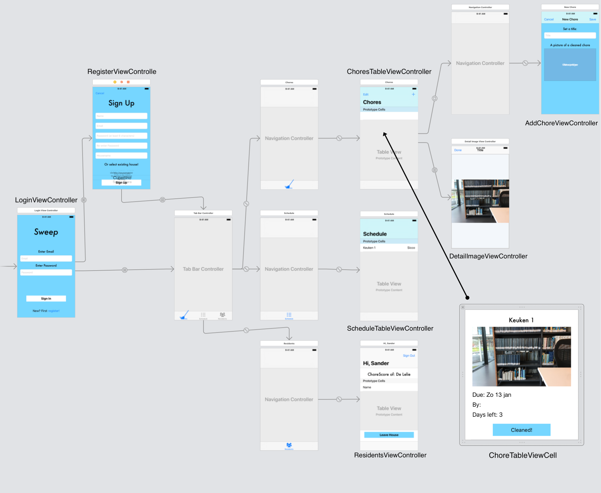

# Final Report - Sweep

Sweep lets users create and join houses to manage the chores that need to be done. To make sure everybody does their chores, Sweep automatically schedules every resident and notifies them when they're up. And to check whether someone has done their chore correctly, residents have to take a picture when they're done.

## Technical Desgin

