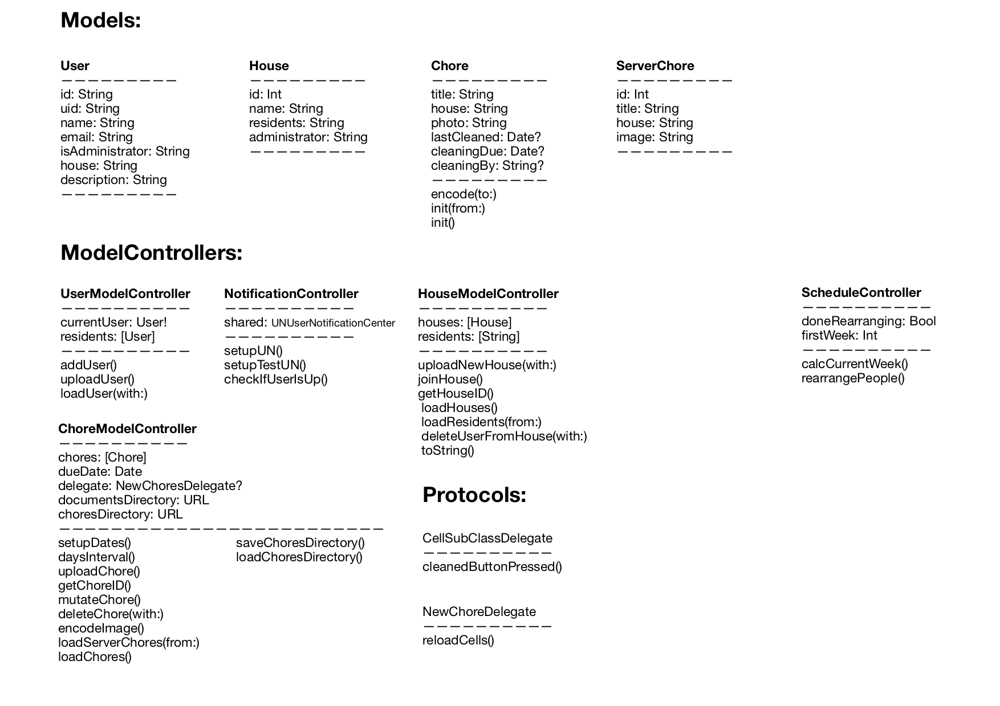

# Final Report - Sweep

Sweep lets users create and join houses to manage the chores that need to be done. To make sure everybody does their chores, Sweep automatically schedules every resident and notifies them when they're up. And to check whether someone has done their chore correctly, residents have to take a picture when they're done.

## Technical Desgin

### LoginViewController
Handles the login screen. If user is already signed in, he/she is redirected to the choreTableView. Requests all neccesary data from the server. After a succesful verification with FireBase and the local server. This viewcontroller is also the destination of the unwind segues: sign out & leave house. If a user doesn't have an account yet, he/she can tap the "register" button, which segues to user to the RegisterViewController. 

### RegisterViewController
